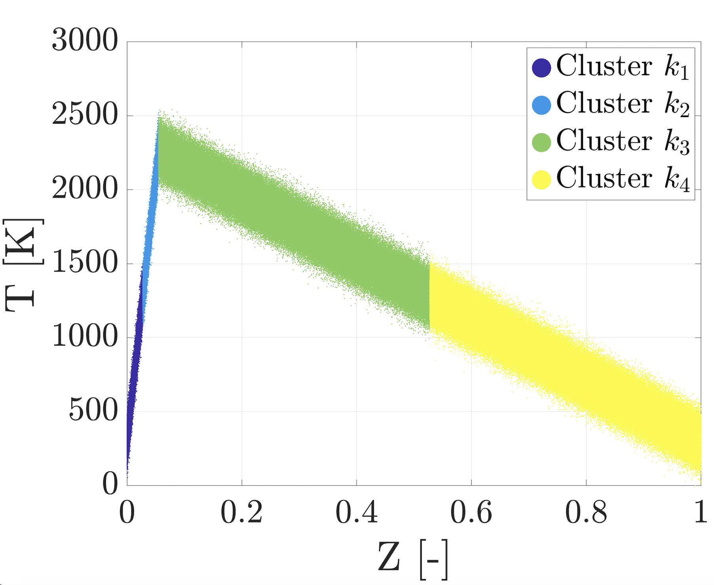

# Clustering

This is a collection of functions that partition (cluster) the data set according to various methods.

All of the functions collected here return a single output: a vector `idx`. Each entry in `idx` specifies the number of cluster to which the observation at that index belongs. An example of such vector could be:

```matlab
idx = [1,1,1,1,2,2,2,2,2,3,3,3,3,3]
```

The above vector has the following interpretation: the first four observations belong to cluster 1, the following five observations belong to cluster 2 and the last five observations belong to cluster 3.

#### Related functions

In order to plot the visualisation of the clustering technique, use the function from the `plotting` repository:

```matlab
plot_mixture_fraction_divided_to_clusters(data, Z, idx, np, destination)
```

## Bins of mixture fraction

Use the function `idx_mixture_fraction_bins()` to partition the data into `k` clusters (bins) according to the mixture fraction space `Z`. Bins intervals are found starting from the first one which divides the `Z` space into two parts at the stoichiometric mixture fraction `Z_stoich`.

```matlab
[idx] = idx_mixture_fraction_bins(Z, k, Z_stoich)
```

A visualisation of the partitioning according to this method:



## K-Means
